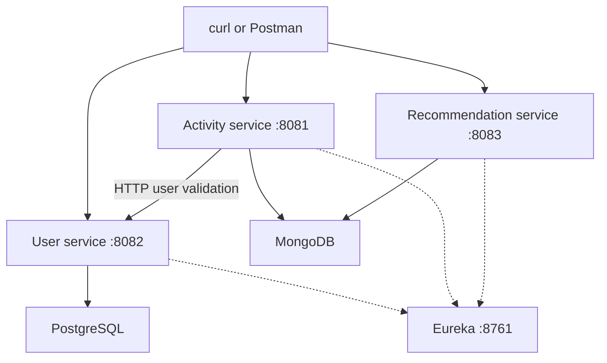

# AI Fitness App

A Java/Spring Boot microservices portfolio project for registering users, recording fitness activities, and retrieving stored fitness recommendations. It demonstrates REST APIs, service discovery, synchronous service-to-service validation, and persistence with PostgreSQL and MongoDB.

> **Current scope:** recommendation retrieval is implemented; AI recommendation generation and Gemini integration are not present in the inspected source. This is a backend project: no frontend, API gateway, or deployed demo is included.

## Verification scope

This README was written from the repository at commit [`0db2f7a`](https://github.com/sharmapranshu1706/AI-FITNESS-APP/tree/0db2f7aabe449cf587953474d294b3c3fff5f789) on 5 October 2026. Controllers, services, DTOs, models, repositories, configuration, Maven manifests, and all four test classes were inspected.

**Source-verified** means a behavior or setting is present in those files. **Illustrative** examples describe the source contract; they are not captured HTTP responses. **Unverified** means builds, dependency availability/compatibility, startup, database connectivity, or runtime behavior were not demonstrated. The inspection environment had Java 17 and no system Maven; it could not validate the Java 21/25 modules. No application code was changed to create this documentation.

## Architecture



The activity service uses a `@LoadBalanced WebClient.Builder` with base URL `http://USER-SERVICE`. Before saving an activity, it calls `GET /api/users/{userId}/validate` and blocks for the Boolean result. User registration persists in PostgreSQL; activities and recommendations use separate MongoDB databases.

There is **no implemented activity-to-recommendation generation link**. RabbitMQ queue/exchange/binding beans exist in the activity service, but no publishing call or consuming listener was found. Gemini is not part of the current runtime graph.

## Modules and stack

Each directory is an independent Maven application with its own wrapper. There is no root Maven aggregator.

| Directory | Responsibility | Port | Configured application name | Java target | Spring Boot | Spring Cloud |
| --- | --- | --- | --- | --- | --- | --- |
| `eureka` | Eureka discovery server (`@EnableEurekaServer`); does not register itself or fetch the registry | 8761 | `eureka` | 17 | 3.5.16 | 2025.0.3 |
| `userService` | Register users, read profiles, check user existence; JPA/PostgreSQL | 8082 | `user-Service` | 21 | 3.5.16 | 2025.0.3 |
| `activityservice` | Validate users, save activities, list and retrieve activities; MongoDB | 8081 | `activity-service` | 21 | 3.5.4 | 2025.0.3 |
| `aiservice` | Read existing recommendations by user or activity; MongoDB | 8083 | Intended `aiservice`; see configuration caveat below | 25 | 4.1.0 | 2025.1.2 |

These are the versions declared in the POMs, not a verified working compatibility matrix. Wrapper distributions are Maven 3.9.15 for activityservice, 3.9.16 for aiservice/eureka, and 3.9.14 for userService. Dependency resolution has not been verified.

Other source dependencies include Lombok, Spring MVC, Spring Data JPA/MongoDB, Eureka clients, WebFlux for the activity service's WebClient, and Spring AMQP/Actuator in the activity service.

## Prerequisites

- Git and a terminal; curl or Postman for API demonstrations.
- JDK 17 for Eureka, JDK 21 for user/activity services, and JDK 25 for aiservice, matching the module targets. Set `JAVA_HOME` per terminal and verify `java -version`. Using one newer JDK for every module is unverified.
- Network access to download the wrapper distributions and Maven dependencies.
- PostgreSQL reachable on port 5432 and MongoDB on port 27017, or equivalent endpoints supplied through overrides.
- RabbitMQ reachable for the activity service's declared AMQP topology. Broker version and runtime startup requirements are unverified.
- Free local ports 8761, 8081, 8082, and 8083.

No Dockerfiles, Compose stack, database migration scripts, seed data, or checked-in API collection were found. Database and broker server versions are not pinned.

## Configuration and environment variables

The repository primarily uses literal YAML settings; it does not include an `.env` loader or an `.env.example`. The following are **Spring configuration override names**, not custom variables referenced by application code. Set them in the terminal launching the relevant service.

| Variable | Module | Purpose / source default |
| --- | --- | --- |
| `SERVER_PORT` | Any | Override the module port listed above |
| `SPRING_APPLICATION_NAME` | Any | Override application name; set `aiservice` explicitly for AI service |
| `EUREKA_CLIENT_SERVICEURL_DEFAULTZONE` | User/activity/AI | Registry URL; `http://localhost:8761/eureka/` |
| `SPRING_DATASOURCE_URL` | User | `jdbc:postgresql://localhost:5432/fitness_user_db` |
| `SPRING_DATASOURCE_USERNAME` | User | `postgres` |
| `SPRING_DATASOURCE_PASSWORD` | User | Supply your local database password; YAML contains a literal development password |
| `SPRING_JPA_HIBERNATE_DDL_AUTO` | User | `update` |
| `SPRING_DATA_MONGODB_URI` | Activity (Boot 3) | `mongodb://localhost:27017` |
| `SPRING_DATA_MONGODB_DATABASE` | Activity (Boot 3) | `fitnessdb` |
| `SPRING_MONGODB_URI` | AI (declared Boot 4) | Intended `mongodb://localhost:27017`; binding unverified |
| `SPRING_MONGODB_DATABASE` | AI (declared Boot 4) | Intended `fitnessRecommendations`; binding unverified |
| `SPRING_RABBITMQ_HOST`, `SPRING_RABBITMQ_PORT` | Activity | Broker connection overrides; absent from YAML |
| `SPRING_RABBITMQ_USERNAME`, `SPRING_RABBITMQ_PASSWORD` | Activity | Broker credentials; absent from YAML |
| `RABBITMQ_QUEUE_NAME` | Activity | `activity.queue` |
| `RABBITMQ_EXCHANGE_NAME` | Activity | `activity.exchange` |
| `RABBITMQ_ROUTING_KEY` | Activity | `activity.routing.key` |

**AI configuration caveat:** `aiservice/src/main/resources/application.yml` uses capitalized `Spring:`, including `Spring.application` and `Spring.mongodb`. Do not assume those settings bind correctly. Supply canonical lowercase properties through environment overrides and confirm the effective application name/database at startup. Boot 4 MongoDB binding has not been tested; verify against the resolved version before relying on it. Do not blindly copy Boot 3's `spring.data.mongodb.*` keys into this module.

Example user-service settings (Bash; use your own password):

```bash
export SPRING_DATASOURCE_URL='jdbc:postgresql://localhost:5432/fitness_user_db'
export SPRING_DATASOURCE_USERNAME='postgres'
export SPRING_DATASOURCE_PASSWORD='<your-local-password>'
```

PowerShell equivalent: `$env:SPRING_DATASOURCE_PASSWORD = '<your-local-password>'`. Environment settings apply only to that terminal and its child process. No Gemini API key variable is consumed by the current source; setting `GEMINI_API_KEY` alone does not enable AI generation.

## Database expectations

| Service | Database | Storage and behavior |
| --- | --- | --- |
| User | PostgreSQL `fitness_user_db` | JPA table `users`; generated UUID string ID, unique/non-null email, non-null password, role default `USER`, creation/update timestamps |
| Activity | MongoDB `fitnessdb` | Collection `activity`; generated string ID, user ID, type, duration, calories, start time, metrics, audited timestamps |
| AI | Intended MongoDB `fitnessRecommendations` | Collection `recommendations`; IDs, activity/user references, recommendation text, improvements/suggestions/safety lists, creation timestamp |

Create the PostgreSQL database before starting the user service:

```sql
CREATE DATABASE fitness_user_db;
```

Run that as a PostgreSQL user with database-creation permission. The application's configured database user must be able to connect and create/alter tables for `ddl-auto: update`. This setting manages tables; it does not create the database. There are no Flyway/Liquibase migrations.

MongoDB databases/collections can be created on first write. The activity document's `additionalMetric` Java field is stored under MongoDB key `metrics`. Recommendation references are strings with no cross-database foreign-key enforcement. The AI service only reads; it will not populate its collection automatically.

**Current credential behavior:** passwords are stored directly and returned in user responses. No hashing, login endpoint, implemented JWT filter, or access control was found. Use fictional demo accounts and local development only until these behaviors are addressed.

## Local setup and run order

```bash
git clone https://github.com/sharmapranshu1706/AI-FITNESS-APP.git
cd AI-FITNESS-APP
```

1. Start PostgreSQL and MongoDB, create `fitness_user_db`, and prepare RabbitMQ for the activity service.
2. Start Eureka; open `http://localhost:8761/`.
3. Start userService and wait for its registration in Eureka.
4. Start activityservice and wait for discovery to resolve `USER-SERVICE`.
5. Start aiservice with the explicit configuration overrides below. Its recommendation endpoints are optional for the user/activity demo.

Use a separate terminal for each service, from the repository root:

```bash
# Terminal 1: JDK 17
cd eureka
bash mvnw spring-boot:run
```

```bash
# Terminal 2: JDK 21; set PostgreSQL overrides first
cd userService
bash mvnw spring-boot:run
```

```bash
# Terminal 3: JDK 21; set database/broker overrides if needed
cd activityservice
bash mvnw spring-boot:run
```

```bash
# Terminal 4: JDK 25
cd aiservice
export SPRING_APPLICATION_NAME='aiservice'
export SPRING_MONGODB_URI='mongodb://localhost:27017'
export SPRING_MONGODB_DATABASE='fitnessRecommendations'
bash mvnw spring-boot:run
```

On Windows PowerShell, use `.\mvnw.cmd spring-boot:run` inside each module and `$env:VARIABLE = 'value'` for configuration. Bash invocation avoids requiring executable permission on the wrapper script.

**Startup is unverified.** The AI entry point is a package-private `static void main(String[] args)`, unlike the other modules' public main methods; verify its Java 25 and Maven-plugin launch behavior. If a declared parent/BOM cannot resolve or a compatibility check fails, record the error and reconcile the dependency versions separately. This README does not silently change the POMs or promise that all four services launch.

## REST API

No gateway is present; call each port directly. Success paths use `ResponseEntity.ok(...)` (HTTP 200), including both POST endpoints. There is no implemented bearer-token requirement. `X-User-ID` is a caller-supplied selector, not authenticated identity.

| Service | Method | Path | Input | Success body |
| --- | --- | --- | --- | --- |
| User :8082 | POST | `/api/users/register` | Registration JSON | `UserResponse` |
| User :8082 | GET | `/api/users/{userID}` | User ID | `UserResponse` |
| User :8082 | GET | `/api/users/{userId}/validate` | User ID | Boolean |
| Activity :8081 | POST | `/api/activities` | Activity JSON with `userId` | `ActivityResponse` |
| Activity :8081 | GET | `/api/activities` | Required `X-User-ID` header | Array of activities |
| Activity :8081 | GET | `/api/activities/{activityId}` | Activity ID | `ActivityResponse` |
| AI :8083 | GET | `/api/recommendations/user/{userId}` | User ID | Array of recommendations; may be empty |
| AI :8083 | GET | `/api/recommendations/activity/{activityId}` | Activity ID | Single-element array if found; throws if absent |

No update/delete endpoints or recommendation-generation POST endpoint were found.

### Register and read a user

Registration validates nonblank/valid email and a nonblank password of at least eight characters. Names have no validation annotations.

```bash
curl -i -X POST http://localhost:8082/api/users/register \
  -H 'Content-Type: application/json' \
  -d '{"email":"demo@example.com","password":"DemoOnly123","firstName":"Demo","lastName":"User"}'
```

Illustrative response (generated IDs/timestamps will differ):

```json
{
  "id": "11111111-1111-4111-8111-111111111111",
  "firstname": "Demo",
  "lastname": "User",
  "password": "DemoOnly123",
  "email": "demo@example.com",
  "createdAt": "2026-10-05T10:00:00",
  "updatedAt": "2026-10-05T10:00:00"
}
```

Request names are `firstName`/`lastName`; response names are `firstname`/`lastname`. The password field shown reflects the actual DTO/service behavior.

```bash
curl http://localhost:8082/api/users/11111111-1111-4111-8111-111111111111
curl http://localhost:8082/api/users/11111111-1111-4111-8111-111111111111/validate
```

Replace the example ID with the registration response ID. Validation returns `true` for an existing user and `false` for an unknown user.

### Track and retrieve an activity

```bash
curl -i -X POST http://localhost:8081/api/activities \
  -H 'Content-Type: application/json' \
  -d '{
    "userId": "11111111-1111-4111-8111-111111111111",
    "type": "RUNNING",
    "duration": 30,
    "caloriesBurned": 250,
    "startTime": "2026-10-05T07:00:00",
    "additionalMetrics": {"distanceKm": 4.5}
  }'
```

Allowed type constants: `RUNNING`, `CYCLING`, `SWIMMING`, `YOGA`, `WEIGHTLIFTING`, `HIKING`, `OTHER`. Duration units are not specified or enforced in the source; this example treats 30 as minutes by demo convention. Metric keys/units are also caller conventions. `startTime` is a timezone-free `LocalDateTime`.

Illustrative response:

```json
{
  "id": "507f1f77bcf86cd799439011",
  "userId": "11111111-1111-4111-8111-111111111111",
  "type": "RUNNING",
  "duration": 30,
  "caloriesBurned": 250,
  "startTime": "2026-10-05T07:00:00",
  "additionalMetric": {"distanceKm": 4.5},
  "createdAt": "2026-10-05T10:01:00",
  "updatedAt": "2026-10-05T10:01:00"
}
```

The request uses plural `additionalMetrics`; the response uses singular `additionalMetric`. No Bean Validation annotations or `@Valid` are present on activity input; positive duration/calories and required fields are not explicitly enforced.

```bash
curl http://localhost:8081/api/activities \
  -H 'X-User-ID: 11111111-1111-4111-8111-111111111111'
curl http://localhost:8081/api/activities/507f1f77bcf86cd799439011
```

### Read stored recommendations

```bash
curl http://localhost:8083/api/recommendations/user/11111111-1111-4111-8111-111111111111
curl http://localhost:8083/api/recommendations/activity/507f1f77bcf86cd799439011
```

A user query against an empty correctly configured collection returns `[]`. An activity query without a matching record throws `RuntimeException`; it does not return an empty list.

Illustrative response **only if a matching recommendation already exists**:

```json
[
  {
    "id": "507f1f77bcf86cd799439012",
    "activityId": "507f1f77bcf86cd799439011",
    "userId": "11111111-1111-4111-8111-111111111111",
    "activityType": "RUNNING",
    "recommendation": "Illustrative demo recommendation.",
    "improvements": ["Illustrative improvement."],
    "suggestions": ["Illustrative suggestion."],
    "safety": ["Illustrative safety note."],
    "createdAt": "2026-10-05T10:02:00"
  }
]
```

This is a schema example, not Gemini output. No seed/import endpoint or generation operation exists.

## Failure handling and Gemini status

### Gemini

No Gemini SDK/client, prompt builder, API URL/key setting, output parser, retry policy, timeout, fallback recommendation, or generation endpoint was found. Consequently:

- Saving an activity does not call Gemini or produce a recommendation.
- Gemini quota errors, invalid credentials, network failures, and malformed outputs have **no implemented handling**.
- A missing stored recommendation is a database lookup failure, not a handled Gemini failure.
- Any claim of live AI advice, graceful Gemini fallback, or automatic asynchronous generation is **unverified and unsupported by the inspected source**.

A future generation feature should define timeout/retry limits, structured output validation, user-visible failure states, and credential configuration, and test those behaviors before advertising them.

### Existing application failures

| Condition | Source behavior |
| --- | --- |
| Duplicate registration email | Throws `RuntimeException("Email Already Exists")` |
| Unknown profile/activity | Throws a runtime exception with a not-found message |
| User validation returns false | Activity creation throws `RuntimeException("Invalid user:" + userId)` |
| Validation HTTP 404 | Validation client throws `IllegalArgumentException` |
| Validation HTTP 400 | Validation client throws `RuntimeException` |
| Other validation HTTP errors | Validation client returns false |
| Discovery/network failure | No dedicated recovery branch; not caught by the `WebClientResponseException` handler |
| No recommendation for activity | Throws `RuntimeException("No Recommendation Found for this activity: " + activityId)` |

No controller advice or custom error-response contract was found. Do not expect consistent 404/409 responses for these runtime exceptions; unhandled runtime exceptions normally become server errors, but exact status/body is unverified. Registration validation errors and a missing required activity-list header use framework handling; their payloads were not captured.

RabbitMQ health is explicitly disabled via `management.health.rabbit.enabled: false`; this does not disable RabbitMQ configuration or prove broker connectivity. No messaging delivery/retry behavior is implemented.

## Testing status

Each module has one `@SpringBootTest` class containing an empty `contextLoads()` test. These are application-context smoke tests, not feature coverage.

No controller/service unit tests, integration scenarios, Gemini failure tests, or CI workflow were found. No tests or builds were executed during this documentation task; no passing-test or coverage claim is made.

Run independently with the matching JDK and infrastructure/configuration:

```bash
bash eureka/mvnw -f eureka/pom.xml test
bash userService/mvnw -f userService/pom.xml test
bash activityservice/mvnw -f activityservice/pom.xml test
bash aiservice/mvnw -f aiservice/pom.xml test
```

On PowerShell, use each module's `mvnw.cmd` with the same `-f` paths. There are no isolated test profiles or embedded/test-container databases in the inspected files, so context tests may require external services. Build artifacts per module with `package`; their POM version is `0.0.1-SNAPSHOT`.

## Portfolio demo: 3–5 minutes

1. Show the module/architecture table and explain PostgreSQL user storage versus MongoDB activity/recommendation storage.
2. Open Eureka and show registered services once startup has been verified.
3. Register a fictional user in Postman/curl and copy the returned ID. Explain the current password limitation.
4. Call user validation; create a RUNNING activity using that ID. Explain the synchronous discovery-based validation before persistence.
5. List activities with `X-User-ID`, then retrieve the activity by its generated ID. Point out the metrics request/response naming difference.
6. If aiservice starts successfully, query recommendations by user and show `[]` on an empty database. Explain that generation is a planned feature. Demonstrate a stored record only when one has been prepared separately, explicitly labeling it as seeded.
7. Close with the next engineering milestones: password hashing and safe DTOs, consistent error handling, tested dependency/configuration alignment, and an implemented/tested AI generation flow.

**Demo acceptance criteria:** user registration succeeds; validation returns true; activity creation persists; listing/by-ID return the saved activity; Eureka registration is visible. Recommendation retrieval is an optional separate step until AI startup/configuration is verified. Do not imply that creating an activity automatically generates advice.

## Known gaps and next steps

- Mixed JDK/framework versions and dependency resolution are unverified.
- AI service's YAML capitalization and effective MongoDB configuration need runtime verification.
- User passwords are stored/returned directly; JWT utility/filter files are empty.
- Activity input validation, ownership checks, pagination, and a consistent error contract are absent.
- RabbitMQ topology is declared, but no event publisher/consumer exists.
- Recommendation generation and Gemini failure handling are absent.
- `ActivityLevel.java` and `FitnessGoal.java` are empty placeholders.
- No frontend, deployment stack, migration/seed scripts, or meaningful feature test coverage is included.
- No repository license file was found; no open-source licensing claim is made.

## Source guide

- [User controller](userService/src/main/java/com/fitness/userservice/controller/UserController.java), [user service](userService/src/main/java/com/fitness/userservice/service/UserService.java), and [user configuration](userService/src/main/resources/application.yml)
- [Activity controller](activityservice/src/main/java/com/fitness/activityservice/controller/ActivityController.java), [activity service](activityservice/src/main/java/com/fitness/activityservice/service/ActivityService.java), and [validation client](activityservice/src/main/java/com/fitness/activityservice/service/UserValidationService.java)
- [RabbitMQ configuration](activityservice/src/main/java/com/fitness/activityservice/config/RabbitMqConfig.java)
- [Recommendation controller](aiservice/src/main/java/com/fitness/aiservice/controller/RecommendationController.java), [recommendation service](aiservice/src/main/java/com/fitness/aiservice/service/RecommendationService.java), and [AI configuration](aiservice/src/main/resources/application.yml)
- [Eureka application](eureka/src/main/java/com/server/eureka/EurekaApplication.java)
